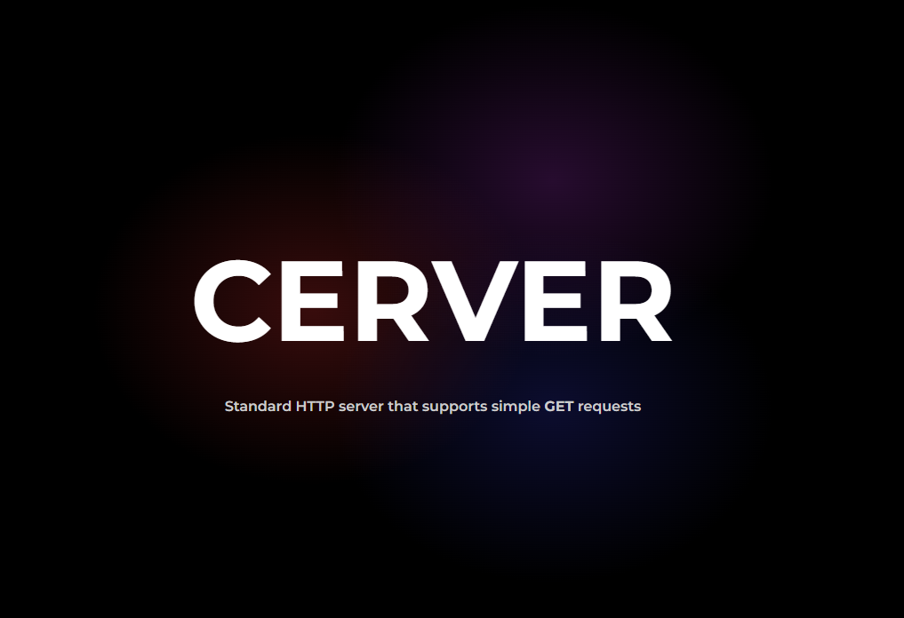

## How to run
- clone the repo using `git clone` 
- run `make`  in the root directory of the project
- run the executable in the `bin/` folder

> [!NOTE]  
> You can customize the executable name my changing the `EXE_NAME`
> variable in the `makefile`

## Features 
*bonus points for not using any external library apart from the win32 api*
- Can parse GET requests and respond with the right file
- Ability to set a webroot
- Mitigation against LFI and path-trasversal malicious requests
- Starts an HTTP web server in the current working directory

## Aditional stuff
- a sample website to test the server with

## Known issues
- Many headers get ignored
- Uses `HTTP/1.1` which is quite old 
- Supports only GET requests
- Lack of protection against certain malformed requests
- Server may need to be terminated with task manager (idk why it persists, may be a thread)
- Windows only (relies heavily on the Win32 API)

